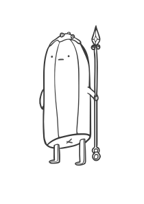

# Banana Guard DSP

I was watching adventure time and thought it would be cool to make a PCB in the shape of one of the banana guards.

At the same time I've been meaning to do a DSP board to fiddle around with. I know there are plenty of dev boards around that I could use, but I like doing everything from scratch.

## Vision

An all-in-one DSP development platform.

1. USB Midi
2. Stereo audio in and out
3. _Enough_ inputs (buttons/pots)
4. Necessary analogue circuitry so that it can realistically be used as a standalone effect/synth in a real setup.
4. _fun_

## Parts choices

Initially I wanted to use the new RP235x chips because they seem very capable for the money and the 2354 with integrated
flash has a lower part count now. Unfortunately at the time of design JLCPCB did not stock these.

I've already used an RP2040 in my [Mimic40]() mechanical keyboard, and use ESP32s a ton at work so I thought that I'd
give the ole STM32s a try again. I very much disliked them in varsity but I've learned a lot since and want to give it a
chance to redeem itself.

I settled on the STM32F429VIT6.
Reasons being:
1. Good support for audio (i2s)
2. Built-in flash (2mb)
3. Not _too_ expensive
4. A lot of gpio (the audio codec has a lot of I/O and i want to have a lot of I/O for the user.)
5. Fairly simple reference design.
6. Good rust support (I will probably go with c++, but have been meaning to fiddle with embedded rust.)

I didn't go with the F439 because i don't think i need the crypto stuff and i didn't go for the F427 because it doesn't
have the LCD-TFT controller (though i doubt I'll use it).

speaking of codecs... I was initially prepared to use separate dac/adc's but after some cursory investigation the
consensus online seems to be that all in one codecs are usually a better choice for real time audio since they suffer
less from unsynchronised clocks and have a lot of useful analog frontend features. I settled on the Texas Instruments
TLV320AIC32 mainly because of a random reddit comment and the fact that Phil's Lab on youtube used it in his guitar FX
dsp board (see [Digital Audio Processing with STM32 \#1 - Introduction and Filters - Phil's Lab \#46](https://www.youtube.com/watch?v=VDhmVrbSpqA)).

## Design

I used an image from a [tutorial on how to draw the banana guard](https://easydraweverything.com/cartoon/banana-guard-adventure-time-drawing/) and then did an outline in inkscape.

